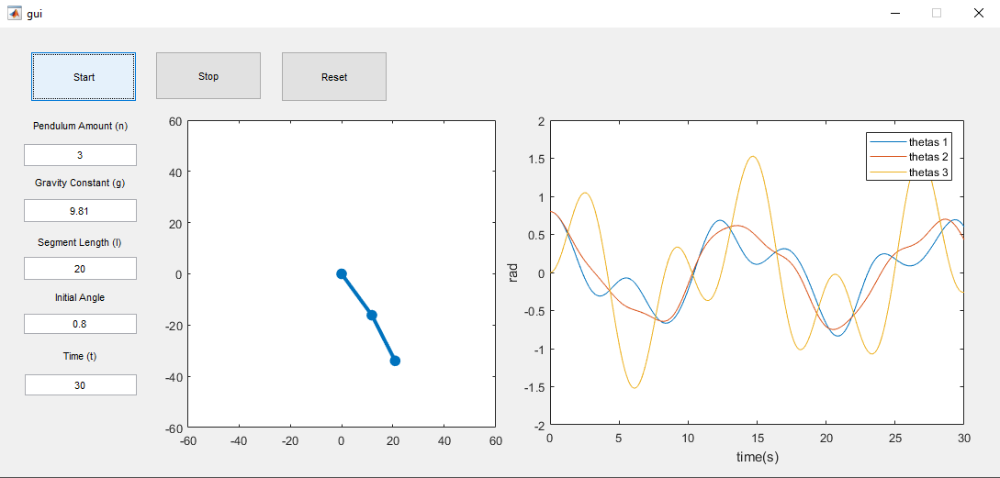

# n-pendulum

An n-pendulum MATLAB GUI for Computation Physics class GUI project assignment.

### Input

-   Pendulum amount (n)
-   Gravity constant (g)
-   Segment length (l)
-   Initial angle (theta)
-   Time (t)

### Output

-   Animation with n-pendulum plot (left plot)
-   Theta vs time plot (right plot)

### References

-   Small Oscillations of the n-Pendulum and the “Hanging Rope” Limit n → ∞ ([Link to paper](http://www.pas.rochester.edu/~rrubenza/projects/RR_PHY235W_TermPaper.pdf))
-   Simplified analytical calculations by Gaffar
